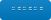

[![Contributors][contributors-shield]][contributors-url]
[![Forks][forks-shield]][forks-url]
[![Stargazers][stars-shield]][stars-url]
[![Issues][issues-shield]][issues-url]
[![MIT License][license-shield]][license-url]
[![Github language count][language-shield]][language-url]
![Snyk Vulnerabilities for npm package][vulnerabilities-shield]
![npm bundle size][size-shield]
![npm][shield-downloads]


<br />
<p align="center">
  <a href="https://github.com/SiddharthShyniben/random-password-generator">
    
  </a>

  <h3 align="center">random-password-generator</h3>
  <p align="center">
    A generator of random passwords
    <br />
    <a href="#documentation"><strong>Explore the docs »</strong></a>
    <br />
    <br />
    <!-- TODO -->
    <!-- <a href="https://github.com/SiddharthShyniben/random-password-generator">View Demo</a> -->
    <!-- · -->
    <a href="https://github.com/SiddharthShyniben/random-password-generator/issues">Report Bug</a>
    ·
    <a href="https://github.com/SiddharthShyniben/random-password-generator/issues">Request Feature</a>
  </p>
</p>

<details open="open">
  <summary><h2 style="display: inline-block">Table of Contents</h2></summary>
  <ol>
    <li>
      <a href="#about-the-project">About The Project</a>
      <ul>
        <li><a href="#built-with">Built With</a></li>
      </ul>
    </li>
    <li>
      <a href="#getting-started">Getting Started</a>
      <ul>
        <li><a href="#prerequisites">Prerequisites</a></li>
        <li><a href="#installation">Installation</a></li>
      </ul>
    </li>
    <li><a href="#usage">Usage</a></li>
    <li><a href="#documentation">Documentation</a></li>
    <li><a href="#roadmap">Roadmap</a></li>
    <li><a href="#contributing">Contributing</a></li>
    <li><a href="#license">License</a></li>
    <li><a href="#contact">Contact</a></li>
    <li><a href="#acknowledgements">Acknowledgements</a></li>
  </ol>
</details>

## About The Project

This library tries to create strong random passwords with a specified length, including and excluding certain characters. It is available as a NodeJS library.

### Strength

According to the library `zxcvbn` by dropbox, 1000 randomly generated passwords with 15 characters generated by this library scored 4/4. (See `index.test.js`)


### Built With

* [NodeJS](https://nodejs.org)

## Getting Started

To get a local copy up and running follow these simple steps.

### Prerequisites

You need to have [npm](https://npmjs.org) and [NodeJS](https://nodejs.org) installed. [npm](https://npmjs.org) comes with [NodeJS](https://nodejs.org).

### Installation

You can install the package using npm. The library has no dependencies except devdependencies for running tests.

1. Install using npm
   ```sh
   npm i random-password-generator
   ```


## Usage

```javascript
const rpg = require('random-password-generator');

const password = rpg({ length: 12, includeChars: ["€"], excludeChars: ["a", "z"] });
// => }u^1J 2kx{8€
const password2 = rpg();
// => vQ%hzIqmZi
```

## Documentation

The usage is pretty simple. First require the module.

```javascript
const rpg = require('random-password-generator');
```
Then you can call it as a function

```javascript
const password = rpg({ length: 12, includeChars: ["€"], excludeChars: ["a", "z"] });
```

The password generated uses all the prinatble characters in the ASCII character set except the `DEL` character (code 32-126). This includes the space (`␣`). You can remove the space by setting `excludeChars` (see below). The length of the password will be 15, the recommended length.

The function takes an `options` object which has the following properties: 
* `length` (number) - The length of the password. If it is 0 it will be set to default.
* `includeChars` (array of strings with length 1) - The characters to include. Nay repeats will be removed.
* `excludeChars` (array of strings with length 1) - The characters to exclude.

## Roadmap

See the [open issues](https://github.com/SiddharthShyniben/random-password-generator/issues) for a list of proposed features (and known issues).


## Contributing

Contributions are what make the open source community such an amazing place to be learn, inspire, and create. Any contributions you make are **greatly appreciated**.

1. Fork the Project
2. Create your Feature Branch (`git checkout -b feature/AmazingFeature`)
3. Commit your Changes (`git commit -m 'Add some AmazingFeature'`)
4. Push to the Branch (`git push origin feature/AmazingFeature`)
5. Open a Pull Request

Be sure to test everything (jest) before pull requesting.

## License

Distributed under the MIT License. See `LICENSE` for more information.

## Contact

Siddharth - siddharth.muscat@gmail.com

Project Link: [https://github.com/SiddharthShyniben/random-password-generator](https://github.com/SiddharthShyniben/random-password-generator)


<!-- ## Acknowledgements

* []()
* []()
* []() -->

[contributors-shield]: https://img.shields.io/github/contributors/SiddharthShyniben/random-password-generator.svg
[contributors-url]: https://github.com/SiddharthShyniben/random-password-generator/graphs/contributors
[forks-shield]: https://img.shields.io/github/forks/SiddharthShyniben/random-password-generator.svg
[forks-url]: https://github.com/SiddharthShyniben/random-password-generator/network/members
[stars-shield]: https://img.shields.io/github/stars/SiddharthShyniben/random-password-generator.svg
[stars-url]: https://github.com/SiddharthShyniben/random-password-generator/stargazers
[issues-shield]: https://img.shields.io/github/issues/SiddharthShyniben/random-password-generator.svg
[issues-url]: https://github.com/SiddharthShyniben/random-password-generator/issues
[license-shield]: https://img.shields.io/github/license/SiddharthShyniben/random-password-generator
[license-url]: https://github.com/SiddharthShyniben/random-password-generator/blob/main/LICENSE.txt
[language-shield]: https://img.shields.io/github/languages/count/SiddharthShyniben/random-password-generator
[language-url]: https://github.com/SiddharthShyniben/random-password-generator
[vulnerabilities-shield]: https://img.shields.io/snyk/vulnerabilities/npm/@siddharthshyniben/random-password-generator
[size-shield]: https://img.shields.io/bundlephobia/min/@siddharthshyniben/random-password-generator
[shield-downloads]: https://img.shields.io/npm/dw/@siddharthshyniben/random-password-generator